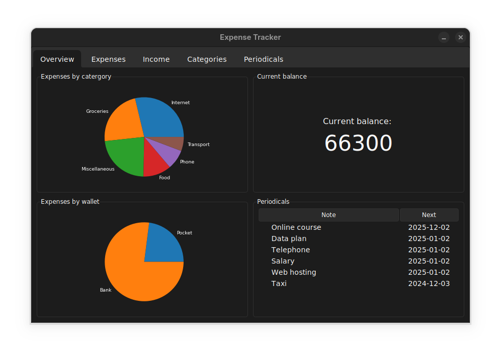
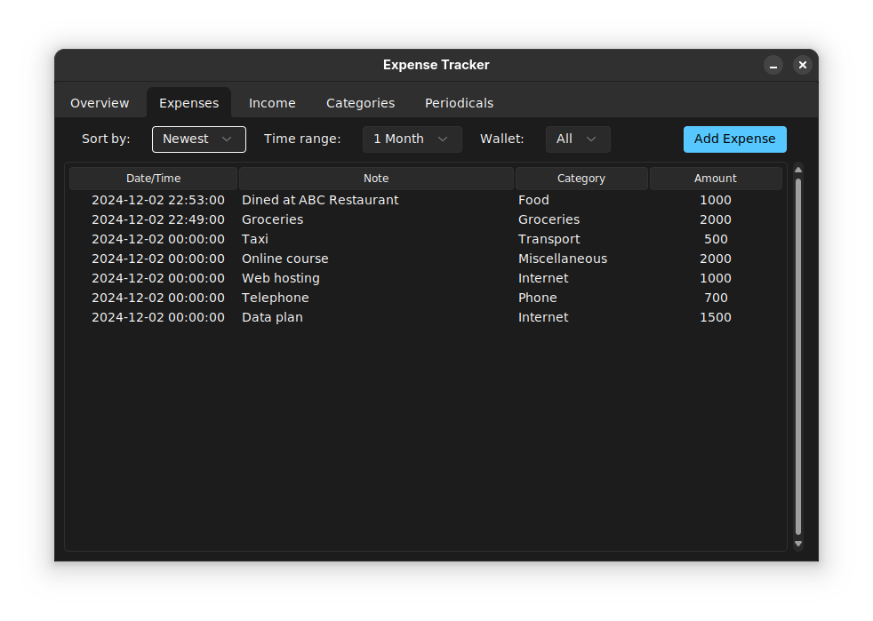
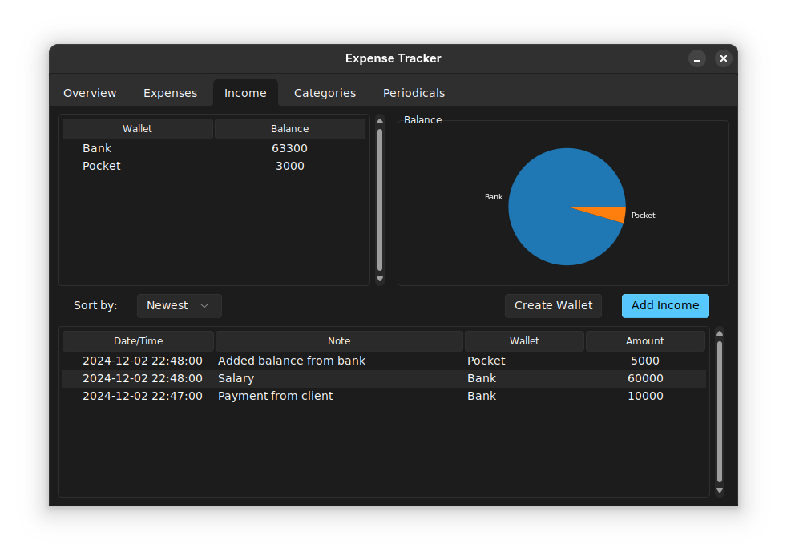
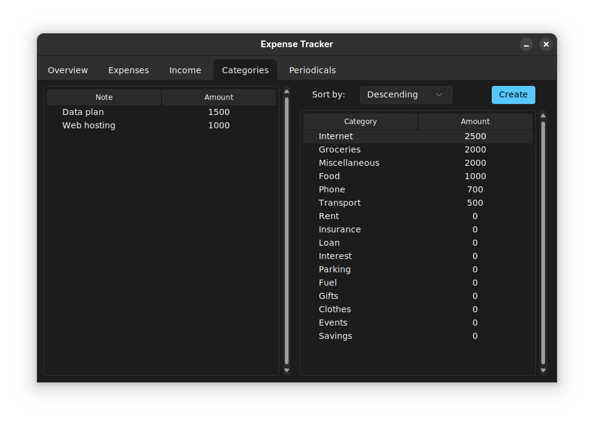
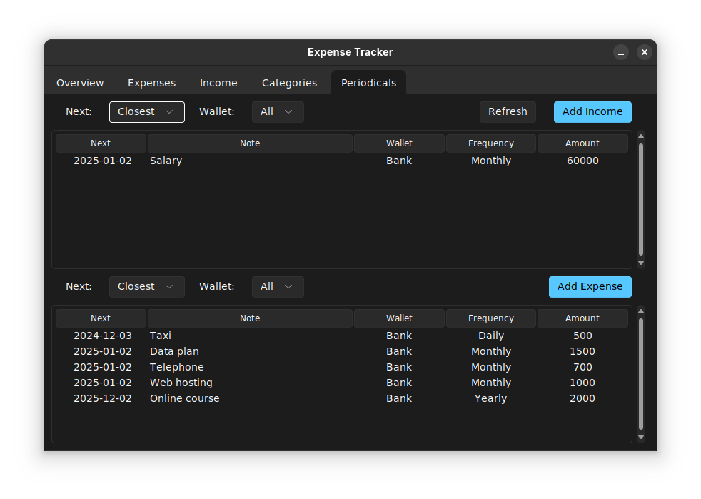

# Expense Tracker
An expense tracking application built with python and tkinter.



# Introduction
The program has five pages:
 * **Overview**: shows an analysis of the data, including the categories of the expenses, the current balance, the wallets used in expenses and the upcoming periodical expenses or income.
 
 * **Expenses**: lists expenses.
 
 * **Income**: lists all income and displays the wallets and their total balance or expenditure as a pie graph.
 
 * **Categories**: shows all the expense categories which are in the database and also shows the expense in each category.
 
 * **Periodicals**: lists the income and expense periodicals.
 

 # Running
 This application requires the following packages:
 * `mysql-connector-python`
 * `sv_ttk`
 * `matplotlib`
 * `tkinter`
 * `python-dateutil`

If the dependencies are satisfied, the application can be run with:
```
python3 main.py
```

# Licence
This program is free software: you can redistribute it and/or modify it under the terms of the GNU General Public License as published by the Free Software Foundation, either version 3 of the License, or (at your option) any later version.

This program is distributed in the hope that it will be useful, but WITHOUT ANY WARRANTY; without even the implied warranty of MERCHANTABILITY or FITNESS FOR A PARTICULAR PURPOSE. See the GNU General Public License for more details.

You should have received a copy of the GNU General Public License along with this program. If not, see <https://www.gnu.org/licenses/>. 